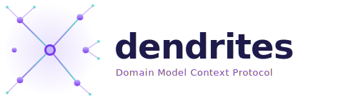

<p align="center">
  
</p>

<p align="center">
  <em>A Rust-based MCP server that feeds <strong>domain model abstractions</strong> into GitHub Copilot,<br/>ensuring AI-generated code follows your architecture, conventions, and domain-driven design patterns.</em>
</p>

<p align="center">
  <a href="#quick-start">Quick Start</a> · <a href="#how-it-works-with-copilot">How It Works</a> · <a href="#domain-model-schema">Schema</a> · <a href="#installation">Install</a>
</p>

---

## Why Dendrites?

### Copilot has no memory across sessions

Without Dendrites, every new chat starts from zero. Copilot re-discovers your architecture by reading files — slowly, incompletely, and inconsistently. Dendrites gives it the full domain model in **few tokens** (one tool call), which is faster and cheaper than Copilot scanning 50 files to piece it together.

### Copilot doesn't enforce architectural boundaries

Left alone, Copilot will happily create a direct import from your domain layer into infrastructure, or skip aggregate roots entirely. Dendrites's `mcp_dendrites_review` and `mcp_dendrites_get_model` act as **guardrails that Copilot checks before generating code**. This is the highest-value feature — preventing architectural drift is expensive to fix later.

### Actual vs Desired: explicit refactoring lifecycle

Dendrites maintains two models side by side:

- **Actual model** — reflects the currently implemented architecture
- **Desired model** — the target state, refined iteratively via `mcp_dendrites_set_model`

The difference between actual and desired is the **pending refactoring**. Call `mcp_dendrites_refactor` (plan) to see the diff and get code actions. After implementing, call `accept` to promote desired → actual. Call `reset` to discard changes.

This separation means Copilot can freely evolve the desired model without side effects — acceptance is always explicit.

## How It Works

```
┌─────────────────────────────────────────────────────┐
│  GitHub Copilot (VS Code)                           │
│                                                     │
│  "Create a new billing endpoint"                    │
│       │                                             │
│       ▼                                             │
│  ┌──────────────┐    MCP stdio   ┌───────────────┐  │
│  │ Copilot Chat │◄──────────────►│ Dendrites Server  │  │
│  │ / Agent      │                │               │  │
│  └──────────────┘                │ ▪ Actual model │  │
│       │                          │ ▪ Desired model│  │
│       ▼                          │ ▪ Diff & plan  │  │
│  Code that follows YOUR          │ ▪ Accept/Reset │  │
│  architecture & conventions      └───────────────┘  │
└─────────────────────────────────────────────────────┘
```

## Quick Start

### 1. Install via Homebrew

```bash
brew tap flavioaiello/dendrites git@github.com:flavioaiello/dendrites.git
brew install dendrites
```

Or build from source:

```bash
cargo build --release
cargo install --path .
```

### 2. Integrate with VS Code / GitHub Copilot

The model is stored in `~/.dendrites/dendrites.db` (CozoDB), keyed by workspace path.
Dendrites starts with an empty model that Copilot can populate via `mcp_dendrites_set_model`.

Add to your project's `.vscode/mcp.json`:

```json
{
    "servers": {
        "dendrites": {
            "type": "stdio",
            "command": "dendrites",
            "args": ["serve", "--workspace", "${workspaceFolder}"]
        }
    }
}
```

After installing, **restart VS Code** or run `> MCP: List Servers` from the command palette to see the Dendrites server listed and active.

### CLI Commands

```bash
# Start MCP server (used by VS Code, not called manually)
dendrites serve --workspace /path/to/project

# Export desired model to JSON
dendrites export model.json --workspace /path/to/project

# Export actual model (from AST scan)
dendrites export actual.json --workspace /path/to/project --state actual

# Export both desired and actual together
dendrites export both.json --workspace /path/to/project --state both

# Scan source code to populate actual state
dendrites scan --workspace /path/to/project

# List all stored projects
dendrites list
```

## How It Works with Copilot

Once connected, Copilot gains access to **6 tools** (4 read, 2 write), **1 prompt**, and **dynamic resources**:

### Read Tools (query the domain model)

| Tool | What it does |
|------|-------------|
| `mcp_dendrites_get_model` | Returns both the actual and desired domain models, including pending changes status |
| `mcp_dendrites_review` | Run Datalog-based analysis: transitive dependencies, layer violations, impact analysis, aggregate quality checks, and custom Datalog queries |

### Write Tools (update the desired model)

All mutations to the desired model are **auto-saved** to the local store.

| Tool | What it does |
|------|-------------|
| `mcp_dendrites_set_model` | Create, update, or remove any element in the **desired** model. Operations merge structures and return suggested file paths automatically. |
| `mcp_dendrites_refactor` | Manage the refactoring lifecycle: `plan` (diff actual vs desired → code actions), `accept` (promote desired → actual), `reset` (discard desired changes), or `scan` (force AST extraction). |

### Resources (Copilot can attach these as context)

| URI | Content |
|-----|---------|
| `dendrites://architecture/overview` | Architecture overview (JSON) |
| `dendrites://architecture/rules` | Architectural rules (JSON) |
| `dendrites://architecture/conventions` | Conventions (JSON) |
| `dendrites://context/{name}` | Per bounded-context detail (JSON) |

### Prompt

| Name | Description |
|------|-------------|
| `dendrites_guidelines` | Architecture guidelines with actual/desired workflow, mandatory tool usage, and project-specific content. Eliminates the need for a per-project `copilot-instructions.md`. |

### Example Copilot Interactions

**You ask:** *"Create a new endpoint to cancel a subscription"*

Copilot will:
1. Call `mcp_dendrites_get_model` → sees actual + desired models, status "in_sync"
2. Call `mcp_dendrites_review` (analysis: `layer_violations`) to ensure the request is valid
3. Call `mcp_dendrites_set_model` to configure the new endpoint as a desired service, receiving auto-generated file paths 
4. Generate code into the suggested path and run `mcp_dendrites_refactor` (action: `accept`)

**You ask:** *"Add a field to User"*

Copilot will:
1. Call `mcp_dendrites_get_model` → sees existing entities, rules, conventions
2. Call `mcp_dendrites_set_model` to add the field to the desired model state
3. Call `mcp_dendrites_refactor` (action: `plan`) → gets prioritized refactoring plan and migration notes
4. Generate the code into `src/`

### Fully Automatic Actual State (Background Watcher)

Dendrites runs a **hot background file watcher** on your workspace's `src/` directory.

1. **Code to Model (Immediate):** As you or the AI writes code and saves `.rs` files, Dendrites immediately unpicks the AST and syncs the database's **Actual State** without prompting.
2. **Model to Code (Desired):** When you ask for a refactoring, Copilot modifies the **Desired State** using `mcp_dendrites_set_model`.
3. **The Refactor Cycle:** Copilot checks `mcp_dendrites_refactor` (plan) to know exactly the file diffs, executes the code, and triggers `accept` if needed. The background watcher confirms it.

## Domain Model Schema

The domain model stored in CozoDB describes your entire system architecture:

```
DomainModel
├── name, description
├── tech_stack (language, framework, database, ...)
├── bounded_contexts[]
│   ├── name, module_path
│   ├── entities[] (fields, methods, invariants, aggregate_root)
│   ├── value_objects[] (fields, validation_rules)
│   ├── services[] (kind: domain|application|infrastructure, methods, dependencies)
│   ├── repositories[] (aggregate, methods)
│   ├── events[] (fields, source entity)
│   └── dependencies[] (allowed cross-context deps)
├── rules[] (id, description, severity, scope)
└── conventions
    ├── naming (entities, services, events, ...)
    ├── file_structure (pattern, layers)
    ├── error_handling
    └── testing
```

## Storage & Inference

Dendrites stores domain models in a local CozoDB database at `~/.dendrites/dendrites.db`, keyed by workspace path. CozoDB is a Datalog-based relational database that enables **logical inference** over the domain model.

Each workspace has two models:

- **Desired** (`model_json`) — the target architecture being refined
- **Actual** (`baseline_json`) — the implemented architecture, updated via explicit `accept`

### Relational Decomposition

When a model is saved, Dendrites decomposes it into 16 CozoDB relations (context, entity, entity_field, entity_method, service, service_dep, event, invariant, etc.) that enable Datalog queries.

### Built-in Analyses (via `mcp_dendrites_review` tool)

| Analysis | What it finds |
|----------|--------------|
| `transitive_deps` | All transitive dependencies from a bounded context using recursive Datalog |
| `circular_deps` | Circular dependency cycles in context dependency graph |
| `layer_violations` | Domain services depending on infrastructure — DDD layer violations |
| `impact_analysis` | Affected events, services, and dependent contexts when changing an entity |
| `aggregate_quality` | Aggregate roots without invariants (quality gap) |
| `dependency_graph` | Full graph JSON with nodes, edges, and cycles |
| `datalog` | Arbitrary Datalog queries against the decomposed model |

### Custom Datalog Queries

Run arbitrary queries against the knowledge graph. Available relations:
`context`, `context_dep`, `entity`, `entity_field`, `entity_method`, `method_param`, `invariant`, `service`, `service_dep`, `service_method`, `event`, `event_field`, `value_object`, `repository`, `arch_rule`

Example: find all aggregate root entities:
```
?[context, name] := *entity{workspace: $ws, context, name, aggregate_root: true}
```

This means:

- **Multi-project support**: Each workspace gets its own isolated model pair
- **Explicit acceptance**: The actual model only changes when you say so
- **No per-project config files needed**: The model lives centrally in the CozoDB store
- **Portable export**: Use `dendrites export --state actual|desired|both` to serialize models
- **Graph-native persistence**: All domain concepts are first-class relational tuples, not JSON blobs

## Architectural Enforcement

Dendrites doesn't just inform — it **constrains**. The `mcp_dendrites_review` tool lets Copilot run mathematical proofs (Datalog queries) over your design, blocking illegal layer dependencies and ensuring architectural rules are respected before a line is written.

Example rules from the included config:
- **LAYER-001**: Domain layer must not depend on infrastructure
- **DDD-001**: State mutations must go through aggregate root methods
- **DDD-002**: Cross-aggregate communication via domain events only
- **ERR-001**: Use typed domain errors, never panic

## Advanced: Custom `instructions.md`

Dendrites ships a built-in `dendrites_guidelines` prompt that serves architecture instructions automatically. For additional project-specific instructions, create `.github/copilot-instructions.md`:

```markdown
## Architecture

This project uses Domain-Driven Design with a hexagonal architecture.
Before writing any code, ALWAYS call `mcp_dendrites_get_model` from the Dendrites
server to understand actual and desired model state.

When mutating models, rely on `mcp_dendrites_set_model` which will return suggested paths.
Before large commits, verify dependency chains using `mcp_dendrites_review`.
Use `mcp_dendrites_refactor` to accept proposed desired state changes.
```

This ensures Copilot **proactively** queries the domain model rather than waiting for tool hints.

## Installation

### Homebrew (recommended)

```bash
brew tap flavioaiello/dendrites git@github.com:flavioaiello/dendrites.git
brew install dendrites
```

### From source

```bash
cargo install --path .
```

## Development

```bash
# Build debug
cargo build

# Run tests
cargo test

# Run with debug logging
RUST_LOG=debug cargo run -- serve --workspace .

# Export a model
cargo run -- export model.json --workspace /path/to/project --state desired

# List stored projects
cargo run -- list
```

## License

MIT
